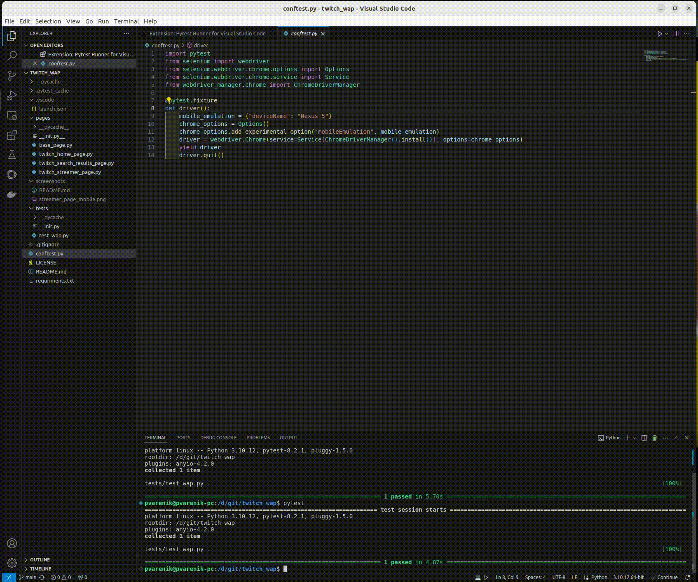
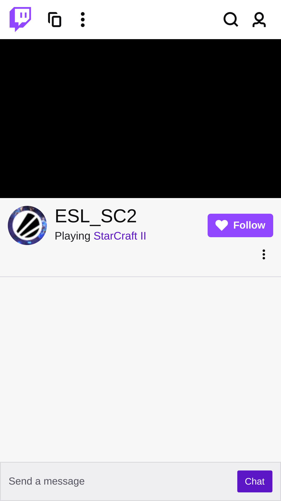

# WAP Testing with Selenium
This repository contains automated tests for the Twitch Web Application (WAP) using Selenium and the Page Object pattern.



## Prerequisites

- Python 3.x

## Setup

1. Clone this repository to your local machine.
2. Install the required Python packages by running:
```pip install -r requirements.txt```

## Running the WAP Test

1. Navigate to the WAP test directory.
2. Run the test using the following command:
```pytest test_wap.py``` or just ```pytest```

## Expected Result

The test should open the Twitch website in mobile emulation mode, perform a search for "StarCraft II", scroll down twice, select a streamer, wait for the stream to load, and take a screenshot of the streamer's page.

## Test Results

The test results will be displayed in the terminal after running the tests. If all tests pass, you will see a success message. If any test fails, you will see an error message with details about the failure.

